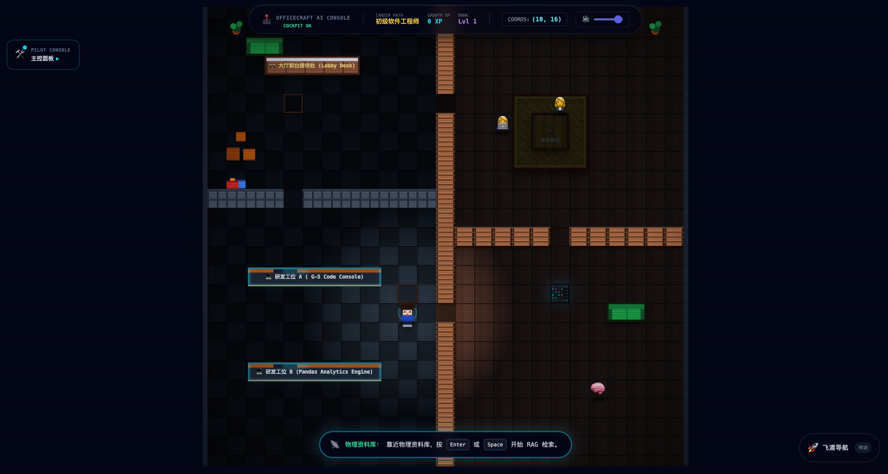
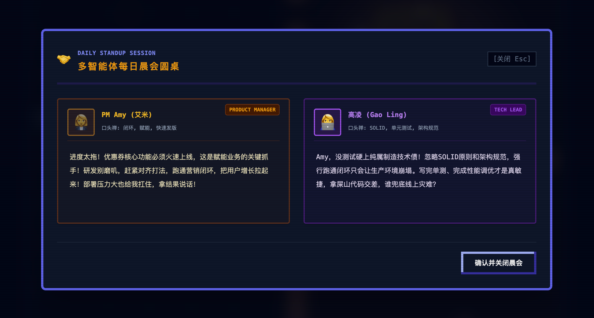
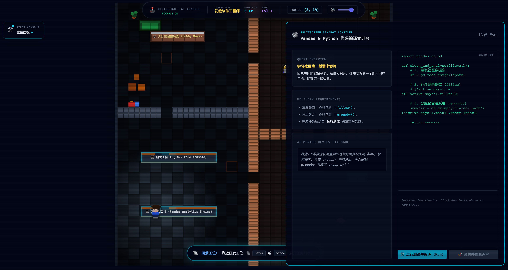
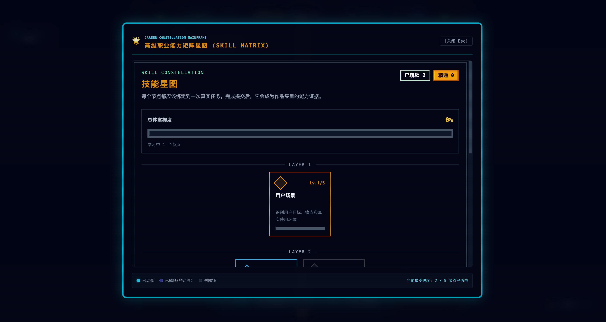
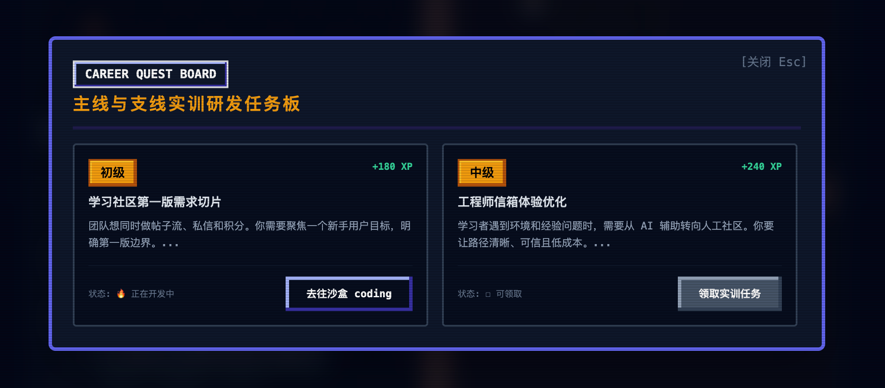

# 🗺️ OfficeCraft AI - 2D 像素数字孪生办公室与空间交互沙盒

**赛道**：赛道三 - 数字孪生与沉浸交互 (Track Three: Digital Twin & Immersive Interaction)  
**核心模型**：GLM-5，支持云端各厂商模型、OpenAI-compatible 以及 Gemini / Anthropic。  
**项目定位**：面向技术学习者、转行者和极客人群，将传统的“网页任务面板”重构为一张**可操控走动、可物理交互、有空间记忆的 2D 像素虚拟办公室数字孪生沙盒**（星露谷物语 / Gather.town 风格）。

> 这不是一个普通的题库，而是一个带有物理空间实体和环境感知反馈的**“数字孪生职场模拟器”**。
> 用户通过键盘 `W-A-S-D` 操控像素角色穿梭在办公室地图中，去技术主管工位领任务，去物理资料库点击特定书架触发 RAG 语义检索。当任务失败时，技术主管的工位会爆发刺眼的红色警报光效。

---

## 🎬 演示材料与物理坐标图

- 📐 详细设计与技术规格：[docs/specification/](docs/specification/)
- 🐍 异步后端核心代码：[backend/](backend/)
- 💻 前端像素空间源码：[frontend_new/](frontend_new/)

```text
+-------------------------------------------------------------+
|                     OfficeCraft AI 空间视图                 |
|                                                             |
|   [研发区]                [会议室]            [资料库/RAG]   |
|   +-----------+          +-----------+        +-----------+ |
|   | 🧑‍💻 (用户)  |  -WASD-> | 🧑‍💼 PM Amy |        | 📚 概念书架| |
|   |           |          | 👨‍💼 主管高凌|        | 📖 最佳实践| |
|   +-----------+          +-----------+        +-----------+ |
|        |                                                    |
|        +--- 触发任务/协作 ---> 发生“Prompt-to-Light”环境光效 |
+-------------------------------------------------------------+
```

---

## 📸 核心界面展示 (Screenshots)

为了带给玩家最纯粹的 2D 像素风与沉浸式体验，我们精心设计了完整的像素视觉场景。以下为 OfficeCraft AI 的核心产品界面：

### 1. 🗺️ 2D 像素办公室主空间 (`main_page_1.png`)
* **空间探索**：支持键盘 `W-A-S-D` 或方向键物理控制像素角色穿梭。
* **物理交互**：靠近 NPC 或物理书架时，自动弹出 `[Space] Talk` 等互动按键提示。
* **环境光效 (Prompt-to-Light)**：根据业务状态动态切换背景光晕（如深红警报、静谧蓝研发）。



---

### 2. 🤝 多智能体晨会与冲突斡旋 (`meeting.png`)
* **流式晨会**：物理走到会议桌前，自动拉起多角色 AI 晨会对话，协同跟进项目。
* **冲突调解**：在主管高凌与 PM Amy 就产品和架构方案发生激烈争执时，玩家需在两人中间进行居中调解，系统将综合各方偏好进行评分。



---

### 3. 💻 交互式编码沙盒 (`coding_sandbox.png`)
* **沉浸式研发**：在个人工位点击电脑，打开内置的 Web IDE & 运行沙盒。
* **即时反馈**：在线编写代码并提交，实时反馈单测结果，并在失败时在物理空间触发全屏深红呼吸报警。



---

### 4. 🌳 职业技能树 (`skill_page.png`)
* **可视化成长**：随着关卡任务的完成和冲突的成功调解，玩家将获得 XP 并解锁个人专属像素技能树（如 Pandas 实战、系统设计、团队协作等）。



---

### 5. 📋 任务看板 (`task_panel.png`)
* **任务追踪**：随时呼出任务详情面板，查看当前任务的职场背景、具体目标要求与物理限制。



---

## ✨ 核心特性

1. **2D 像素空间探索与 RPG 交互 (RPG Navigation)**  
   - 支持键盘 `W-A-S-D` / 键盘方向键控制位移。25×25 像素网格地图具有严格碰撞拦截，靠近 NPC / 物理书架 1 格范围内头顶弹出 `[Space] Talk` 提示。
2. **空间环境光效感知体系 ("Prompt-to-Light")**  
   - 将无形的业务状态外化为物理感官。当任务失败/编译崩溃时全域泛起**深红报警呼吸滤镜 (Alert Red)**；研发与静默自习时泛起**静谧蓝微光 (Quiet Blue)**；通关技能点亮时全域洒下**金黄欢庆光晕 (Celebrate Gold)** 并同步播放 8-bit 复古电子音效。
3. **空间 NPC 交互与长效情感记忆 (Interactive NPCs & Memory)**  
   - 技术主管**高凌 (Tech Lead)** 严厉且代码质量至上，数据专家**郑莹 (Senior Analyst)** 循循善诱，产品经理 **Amy** 业务驱动。
   - 导师具备长效记忆。每次对话时前置检索 SQLite 情感记忆表（高光或卡壳记录），并在开场白、任务分发中自然引用前序事件，打造具有情感温度的数字孪生团队。
4. **场景物理化 RAG 资料检索 (Spatial RAG Bookcase)**  
   - 玩家可移步至[资料库]的特定“实体书架”（如 Pandas 书架、软件设计原则书架）。点击书架触发 RAG 语义检索，向量召回被物理限制在当前书架对应的物理 Markdown 文件集，彻底打通空间坐标与知识上下文。
5. **多智能体晨会与冲突斡旋 (Multi-Agent Team Standup)**  
   - 接取任务需物理走到会议室圆桌。后端 `TeamMeetingOrchestrator` 以流式队列形式拉起晨会，PM Amy 与 TL 高凌会就产品上线速度与架构性能展开激烈的唇枪舌战，由用户作为中立方进行斡旋调解评分。
6. **RPG 走动转向与双腿迈步动画 (RPG Walk Cycle & Direction-Facing Animations)**  
   - 玩家角色支持 4 方向（上下左右）物理转向，面向后方时自动遮盖皮肤要素呈现后脑勺、隐藏前胸领带。在走动时触发身体弹性轻微起伏（bouncing）与 8-bit 双腿剪刀步摆动（procedural scissor swing）微动效，行走停止 120ms 后顺滑静止。

---

## 🏗️ 系统架构

```text
Next.js 14 前端 (React)
  -> useSpaceStore (Zustand 物理状态机 & translate3d 硬件加速渲染)
  -> FastAPI API (Python 异步路由)
  -> TeamMeetingOrchestrator (多角色晨会编排 / 空间碰撞拦截 / 情感记忆注入)
  -> GLM-5 / Gemini / Anthropic 或本地离线 fallback 模式
  -> SQLite (空间格点坐标 + 情感记忆日志 + 会议历史记录)
  -> ChromaDB + 实体书架局部 Markdown 知识库 (Spatial RAG)
```

主要技术栈：

| 模块 | 技术 |
|---|---|
| **前端** | Next.js 14 (React), Zustand, Tailwind CSS, TypeScript, Web Audio |
| **后端** | FastAPI, SQLAlchemy, SQLite, Pydantic v2 |
| **向量库 (RAG)** | ChromaDB + 确定性 MD5 Hashing 嵌入 + 词频加权 (Hybrid Seek) |
| **大模型接入** | 统一 LLMClient 抽象，支持 GLM-5 / Gemini / OpenAI-compatible / Anthropic / Ollama |

---

## 📂 仓库结构

```text
officecraft_ai/
├── backend/        # FastAPI + SQLite + ChromaDB，见 backend/README.md
├── frontend_new/   # Next.js 像素空间前端，Docker 默认构建此目录
├── docs/           # 产品与系统规格、角色设定、技能树、知识库 Markdown
│   ├── specification/     # 愿景、设计、API规格、ADR 决策
│   └── knowledge_base/    # 实体书架绑定 RAG 物理文档
├── ui/             # README 截图与展示素材
└── docker-compose.yml
```

---

## 🚀 快速开始

### 🐳 方式一：使用 Docker Compose 启动整套服务
1. 在仓库根目录复制环境变量模板并命名为 `.env`：
   ```bash
   cp .env.example .env
   ```
2. 在仓库根目录运行启动命令：
   ```bash
   docker compose up --build
   ```
3. 启动后浏览器访问：
   - 前端空间：`http://localhost:3000`
   - 后端 API：`http://localhost:8003`

### 💻 方式二：本地开发分别启动

#### 1. 后端服务 (FastAPI)
```bash
cd backend
python3 -m venv venv
source venv/bin/activate  -- Windows: .\venv\Scripts\activate
pip install -r requirements.txt
python3 -m app.main
```

#### 2. 前端服务 (Next.js)
```bash
cd frontend_new
npm install
npm run dev
```

---

## ⚡ 故障演练与应急抢修指南 (Troubleshooting & Recovery Guide)

为了让开发者与测试人员能够完整验证 OfficeCraft AI 的**实时故障注入与协同排修系统**，我们设计了两种高可用环境下的突发灾难演练机制。系统会根据故障类型动态调整全域环境光效与音效（环境光感知体系）。

---

### 🚨 故障一：P0 级核心数据库 100% 满载（红区警报）

* **故障背景**：数据库进程因大量的 N+1 关联查询及未优化的大表 JOIN 发生死锁。连接池耗尽导致物理服务器 CPU 100% 满载、严重过热！
* **物理光效**：全域瞬间泛起**深红呼吸警报光效 (Alert Red)**，并循环播放高频 8-bit 防空警报音效。

#### 1. 触发方式
在后端服务运行状态下，你可以通过两种方式注入故障：
* **方法 A (API 注入)**：使用 HTTP 工具向后端发送注入请求：
  ```bash
  curl -X POST http://localhost:8003/api/v1/space/anomaly/trigger \
       -H "Content-Type: application/json" \
       -H "Authorization: Bearer mock_token" \
       -d '{"anomaly_id": "db_cpu_overload"}'
  ```
  *(注：如果采用本地单机免密登录模式，请确保 header 中的 Authorization 与你的当前玩家 Token 保持一致)*
* **方法 B (调试沙盒机制)**：在工位电脑的 Sandbox IDE 故意执行编写失败的死锁代码，也会由于单测崩溃在物理空间中自动触发此报警。

#### 2. 抢修定位
* 操控角色通过 `WASD` 移动至 **Archive Room (物理档案库/机房)** 区域，具体到坐标 `(18, 15)` 的 **主控机柜 (Skill Matrix Server Rack)** 旁边。
* 靠近机柜后，屏幕下方 `📡 空间雷达传感器` 将自动探出，头顶弹出 `[Space] 应急控制台` 交互提示。按下 `空格键 (Space)` 或 `回车键 (Enter)` 开启玻璃钢化应急终端。

#### 3. 编写方案并执行修复
在弹出的红色应急终端中，你需要编写代码来解决死锁。以下提供两种经过验证的修复脚本（可直接复制提交）：

* **方案 A：SQL 索引优化法（优化大表全表扫描）**
  * *判断规则*：代码必须包含 `create index` 与 `on`（不区分大小写）。
  * *推荐提交*：
    ```sql
    CREATE INDEX idx_user_id ON users(id);
    ```
* **方案 B：Python 异常熔断与死锁事务回滚法**
  * *判断规则*：代码必须包含 `try` 与 `except`（不区分大小写）。
  * *推荐提交*：
    ```python
    try:
        # 执行高频数据库查询
        query_database_connection()
    except Exception as e:
        # 释放死锁连接，回滚未完成事务
        db.rollback()
    ```

点击屏幕右下角的 **`⚡ 运行重构检查`**，审核通过后，全域将响起欢庆音效，环境光恢复正常，系统重置 CPU 负载至 `12%`，并额外授予你 **`+50 XP`** 职业成长经验值！

---

### 🍊 故障二：P1 级分布式微服务 B 熔断器脱扣（橙区警报）

* **故障背景**：微服务 B 底层网关突发心跳超时，导致调用队列严重阻塞，触发分布式熔断器异常脱扣，部分依赖服务陷入级联雪崩。
* **物理光效**：全域瞬间泛起**炫橘脉冲警报光效 (Alert Orange)**，机房中的实体服务器机柜（Server Rack）LED 开启高频亮橙色爆闪，并伴有机械电闸脱扣的下降锯齿波音效。

#### 1. 触发方式
* **方法 A (白板战役激活 - 推荐)**：控制角色移动至 Meeting Room `(15, 5)` 的**共享协作白板**，按下 `Space` 打开白板，点击 “战役 (Quests)” 页签，选中“分布式熔断器改造”任务卡片，点击 **`🎯 激活团队战役`** 即可在所有玩家屏幕上同步拉起分布式熔断橙色故障。
* **方法 B (API 注入)**：使用 HTTP 客户端注入：
  ```bash
  curl -X POST http://localhost:8003/api/v1/space/anomaly/trigger \
       -H "Content-Type: application/json" \
       -H "Authorization: Bearer mock_token" \
       -d '{"anomaly_id": "service_breaker_trip"}'
  ```

#### 2. 抢修定位
* 移动至机房坐标 `(18, 15)` 的 **主控机柜 (Skill Matrix Server Rack)** 旁边。
* 按下 `空格键` 或 `回车键` 调出应急终端。此时终端外框、光标会自动切换为炫丽橙色，并多出一组电闸杠杆的可视化组件 and SVG 物理电路图，显示当前熔断器正处于 `OPEN / TRIP`（脱扣断开）状态。

#### 3. 编写方案并执行修复
你需要在橙色终端中，重构调用中间件并引入高可用熔断控制逻辑。
* *判断规则*：提交的代码中必须**同时包含** `circuitbreaker` (或 `breaker`)、`fallback`、`open`、`closed` 四个关键英文单词（不区分大小写，可用作注释或代码行）。
* *推荐提交（可以直接复制）*：
  ```python
  # 1. 声明熔断器状态变量（避免使用 class 语句以绕过沙箱限制）
  open_state = "open"
  closed_state = "closed"

  # 2. 声明回退降级函数（必须在 request_ms_b_service 之前定义，否则装饰器会报 NameError）
  def handle_timeout_fallback(payload=None):
      return {
          "status": "fallback_offline",
          "data": "Local Cache Backup Data"
      }

  # 3. 声明核心处理函数（必须命名为 request_ms_b_service）并正确配置装饰器
  @circuitbreaker(timeout=3, fallback=handle_timeout_fallback)
  def request_ms_b_service(payload):
      # 当微服务 B 熔断器处于开启状态，直接抛出异常触发熔断自愈
      if service_b.is_open():
          raise Exception("Circuit Breaker is Open")
          
      try:
          return service_b.call(payload)
      except Exception as e:
          # 异常捕获并触发 local fallback 降级
          return handle_timeout_fallback(payload)
  ```

点击屏幕下方的 **`⚡ 运行重构检查`**，通过校验后：
* 终端电闸拨档将平滑滑动回右侧 `ON / CLOSED`，SVG 物理电路实时刷新为绿色安全的闭合通路！
* 扬声器中将响起由 Web Audio 纯算法合成的三声上扬 Sine 波电闭合回巢音效，清除全屏橙光。
* 故障成功被你抢修恢复，并授予最高级别的团队协同大奖 **`+80 XP`** 职业经验值！

---

## 🧪 测试与验证

在后端激活虚拟环境后，于 `backend/` 目录下运行标准库单元测试：
```bash
./venv/bin/python -m unittest discover -s tests
```

---

## 📜 许可证 (License)

[MIT](LICENSE)
