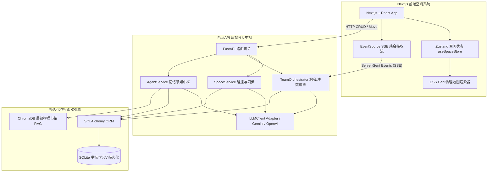

# 👾 OFFICECRAFT AI 部署与开发调试指南 (System Setup & Deployment Manual)

本指南旨在帮助开发团队与后续接手的工程师快速在本地或 Docker 环境下，拉起 **OfficeCraft AI (2D 像素数字孪生办公室与空间交互沙盒)** 的前后端服务。本系统融合了复古 2D 像素美学与现代 AI 驱动的数字孪生空间。

---

## 🛠️ 系统整体架构拓扑 (Architecture Overview)



---

## 💻 1. 前端服务搭建 (Frontend Setup)

前端基于 **React (Next.js 14) + TypeScript + Zustand** 构建，完全采用 CSS Grid 与绝对定位 `translate3d` 硬件加速技术打造像素级的世界。

### 📋 前期准备
- **Node.js**: 推荐 v18.0.0 或更高版本
- **包管理器**: `npm` 或 `yarn`

### 🚀 启动步骤
1. 进入前端物理工作目录：
   ```bash
   cd frontend_new
   ```
2. 安装项目依赖：
   ```bash
   npm install
   ```
3. 启动本地开发热重载服务器 (Next.js Dev Server)：
   ```bash
   npm run dev
   ```
   > [!NOTE]
   > 默认启动在 `http://localhost:3000` (或向后顺延)。
4. 编译生产环境静态资源：
   ```bash
   npm run build
   ```

---

## 🐍 2. 后端服务搭建 (Backend Setup)

后端基于 **FastAPI** 异步 Web 框架构建，配合 **SQLAlchemy ORM** 实现空间坐标及长效情感记忆，并通过 **ChromaDB** 提供局部物理书架 RAG 知识检索。

### 📋 前期准备
- **Python**: 3.11 或更高版本
- **Virtualenv**: 强烈建议使用虚拟环境进行隔离

### 🚀 启动步骤
1. 进入后端物理工作目录：
   ```bash
   cd backend
   ```
2. 创建并激活虚拟环境：
   ```bash
   # MacOS / Linux
   python3 -m venv venv
   source venv/bin/activate

   # Windows
   python -m venv venv
   .\venv\Scripts\activate
   ```
3. 安装依赖包：
   ```bash
   pip install -r requirements.txt
   ```
4. 启动后端 ASGI 服务器 (Uvicorn)：
   ```bash
   python3 -m app.main
   ```
   > [!NOTE]
   > 默认启动在 `http://127.0.0.1:8000`。
   > FastAPI 会自动在 `http://127.0.0.1:8000/docs` 渲染出交互式 Swagger UI 调试文档。

---

## 🛢️ 3. 关系型数据库空间自愈建表 (Self-Heal Schema)

系统采用 SQLAlchemy ORM 自动初始化。未配置 `DATABASE_URL` 环境变量时，会自动在 `backend/` 下创建名为 `officecraft_ai.db` 的本地 **SQLite** 数据库。

> [!IMPORTANT]
> **零管理自愈建表 (Self-Heal)**:
> 无论是 SQLite 还是 PostgreSQL，系统启动时，FastAPI 的 `lifespan` 均会自动执行表结构自愈检测。如果物理表不存在，将自动根据 ORM 实体创建全部基础表（包含新增的 `user_emotional_memories` 情感记忆表与 `team_meeting_logs` 站会记录表），无需工程师手动运行任何 SQL 初始化脚本。

---

## 📚 4. 局部 RAG 物理书架预热 (Spatial RAG & ChromaDB)

系统配备物理书架范围绑定的 RAG 知识库，用于在玩家走到特定书架交互时提供对应的支持。

### 🔍 运行原理
1. **启动预温**：应用拉起时，FastAPI 的 `lifespan` 扫描 `docs/knowledge_base/` 目录下的物理 Markdown 文档，对 Pandas、软件设计等专业模块进行文本切片 (Chunking)。
2. **确定性 MD5 Hashing 嵌入**：系统使用 MD5 特征哈希算法，完全避开外部重型 Python 深度学习模型下载，实现 100% 毫秒级本地 L2 向量计算。
3. **物理召回绑定**：当玩家在 [资料库] 中点击 `pandas_library` 物理书架发起查询时，ChromaDB 仅在该书架对应相对路径的物理 Markdown 切片中进行语义检索。

---

## 🧪 5. 自动化测试矩阵执行 (Standard Library Testing)

我们基于 Python 标准库中的 `unittest` 框架设计了全量单元测试用例，实现了 100% 离线依赖、内存 SQLite 数据沙盒隔离。

### 🚀 运行命令
在后端激活虚拟环境后，于 `backend/` 路径下运行：
```bash
./venv/bin/python -m unittest discover -s tests
```

---

## ⚠️ 常见故障排除 (Troubleshooting & Tips)

> [!WARNING]
> **1. 前端 WASD 键盘移动时画面卡顿**
> - **原因**: 玩家走动时不断更新 Zustand 坐标，如果没有加节流，高频向后端发起 `/space/move` 请求会造成网络阻塞。
> - **自愈**: 请确保 `frontend_new/src/services/api.ts` 中的 `syncMove` 被包裹在 `lodash.throttle(..., 50)` 中，实现 50 毫秒强制网络节流，而本地组件坐标平移 `transform 0.1s linear` 保持顺滑。
>
> **2. 玩家刷新页面后，环境色变回默认白色**
> - **原因**: 前端 Store 重置，未调用状态恢复。
> - **修复**: 进入大厅时，必须前置执行 `await spaceStore.syncFromBackend()`，拉取 `/api/v1/space/state`，无损恢复包括坐标、不活跃冲突以及 `ambient_theme` 全局样式在内的所有空间背景。
