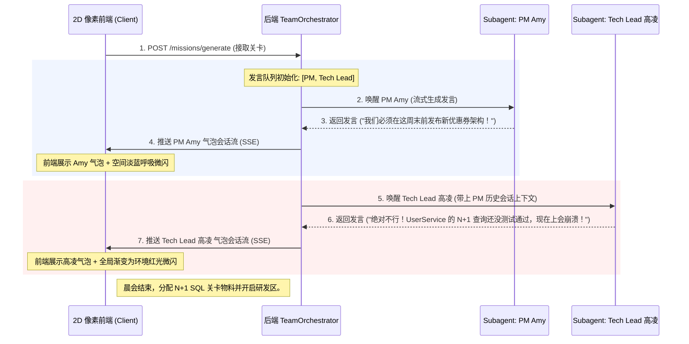

<!-- mdformat global-off -->
# 前后端系统框架详细设计 (Architecture Framework)

本文档详细规定了 **OfficeCraft AI (2D 像素数字孪生办公室)** 的前后端系统架构分层、核心模块交互协议以及标准工程目录树，旨在为开发团队提供高清晰度、可落地的开发指南。

---

## 一、 系统整体拓扑与流转关系

本系统采用前后端解耦的设计。前端通过轻量级 HTML5 / CSS3 硬件加速技术渲染 2D 像素风地图并捕获 WASD 键盘位移，后端利用 FastAPI 异步框架管理空间状态、编排多角色 standup 会议、并调用持久化及向量检索双底座。

```text
  +-------------------------------------------------------+
  |              游戏化沉浸前端 (Next.js / React)         |
  |                                                       |
  |  +--------------------+        +-------------------+  |
  |  |   2D RPG 空间视图  |        |    Zustand Store  |  |
  |  | (WASD走动/碰撞/交互) | <====> |  (useSpaceStore)  |  |
  |  +--------------------+        +-------------------+  |
  |           |                              |            |
  +-----------|------------------------------|------------+
              | 物理交互事件                  | 空间坐标/光效同步
              |                              | (50ms 节流限制)
              v                              v
  +-------------------------------------------------------+
  |             后端异步中枢 (FastAPI / Python)           |
  |                                                       |
  |  +------------------+          +-------------------+  |
  |  |  SpaceRoute / RAG |          | TeamOrchestrator  |  |
  |  | (坐标验证/书架检索) |          | (站会/冲突编排流) |  |
  |  +------------------+          +-------------------+  |
  |           |                              |            |
  +-----------|------------------------------|------------+
              v                              v
  +-------------------------------------------------------+
  |                   持久层与大语言模型                  |
  |                                                       |
  |  +------------------+  +------------------+  +------+ |
  |  | SQLite (空间/情感) |  | ChromaDB (RAG分块) |  | LLM  | |
  |  +------------------+  +------------------+  +------+ |
  +-------------------------------------------------------+
```

---

## 二、 前端架构分层设计

前端整体采用 **Next.js + React (TS)** 构建。为确保极高的运行性能和原生复古质感，摒弃大型 WebGL 引擎，完全基于 **Tailwind CSS + Vanilla CSS** 研发。

### 1. 视图与页面层 (Pages & Views)
- **`LobbyPage` (前台大厅)**：玩家登录默认初始落脚点。负责展示打卡成就、XP 进度条等。
- **`OfficeMapPage` (2D 办公室大厅)**：核心交互空间。采用 CSS Grid 绘制 25×25 地图块，以绝对定位渲染玩家、NPC、实体书架及周边绿植。
- **`MeetingModal` (会议斡旋框)**：采用 RPG 复古羊皮纸边框和点阵字体，承载每日晨会 SSE 会话气泡和调解面板。
- **`DeskWorkstation` (工位电脑面板)**：玩家工位，包含任务详情、代码/报告提交编辑器及 AI 导师打分。

### 2. 核心状态引擎层 (useSpaceStore - Zustand)
- **`playerCoord`**：当前玩家物理格点坐标 `{x, y}`。
- **`ambientTheme`**：当前办公室光影滤镜（`quiet-blue` | `alert-red` | `celebrate-gold` | `default`）。
- **`collisionMatrix`**：2D 二进制碰撞拦截数组（`0` 通行，`1` 墙体、书架或 NPC）。
- **`setPlayerCoord(x, y)`**：更新位置并计算是否与周边 NPC / 物件触发了 $\le 1$ 格邻近状态，更新 `interactiveNpcId`。
- **`movePlayer(dx, dy)`**：
  ```typescript
  const movePlayer = (dx: number, dy: number) => {
    const { playerCoord, collisionMatrix } = get();
    const nextX = playerCoord.x + dx;
    const nextY = playerCoord.y + dy;
    
    // 格点界限及碰撞矩阵拦截
    if (nextX >= 0 && nextX < 25 && nextY >= 0 && nextY < 25) {
      if (collisionMatrix[nextY][nextX] === 0) {
        setPlayerCoord(nextX, nextY);
        // 调用 POST /api/v1/space/move 进行坐标后端存储同步 (带50ms节流)
        spatialApi.syncMove(nextX, nextY);
      }
    }
  };
  ```

---

## 三、 后端架构分层设计

后端采用 **FastAPI (Python 3.11+)** 构建，深度整合大语言模型结构化输出与本地双引擎存储。

### 1. 接入路由层 (Routers)
- `GET /api/v1/space/state`：空间与逻辑状态无损恢复。
- `POST /api/v1/space/move`：坐标物理位移记录及近接交互判定。
- `POST /api/v1/space/rag/search`：限定物理书架的主题 RAG 精准检索。
- `POST /api/v1/missions/generate`：唤起晨会及分配初始代码/CSV 物料。
- `POST /api/v1/missions/evaluate`：大模型多维评审、发放 XP 并自动向 SQLite 记录本关卡高光/卡壳记忆。
- `GET /api/v1/agent/chat`：双向注入上下文与情感记忆的 SSE 多角色扮演对话。

### 2. 多智能体站会编排服务 (`TeamStandupOrchestrator`)
每日晨会及冲突博弈引入了**发言队列及状态控制**：



---

## 四、 统一工程目录树规划

```text
officecraft_ai/
├── frontend_new/                        # 数字孪生前端工程 (Next.js + Zustand + Tailwind CSS)
│   ├── public/
│   │   ├── assets/                      # 2D 像素地图瓦片图、NPC 走动雪碧图 (PNG)
│   │   └── sfx/                         # 8-bit FC 电子音效、报警声 (WAV/MP3)
│   ├── src/
│   │   ├── app/                         # Next.js App Router 页面 (Lobby, Map, Meeting)
│   │   ├── components/
│   │   │   ├── space/                   # 2D 空间渲染组件 (PixelMap, PlayerSprite, LightOverlay)
│   │   │   ├── common/                  # 像素 UI 库 (PixelButton, RetroDialog)
│   │   │   └── dashboard/               # 技能树连线、XP 结算看板
│   │   ├── stores/                      # Zustand 状态存储 (useSpaceStore, useUserStore)
│   │   ├── services/                    # API 请求适配器与 SSE 监听流
│   │   └── styles/                      # Tailwind CSS 及 HSL 渐变滤镜
│   ├── package.json
│   └── tailwind.config.js
│
├── backend/                             # 异步后端服务 (FastAPI)
│   ├── app/
│   │   ├── api/
│   │   │   └── v1/                      # 路由分发 (space, careers, missions, agent)
│   │   ├── core/
│   │   │   ├── config.py                # 全局数据库连接、LLM 超参、CORS origins
│   │   │   └── paths.py                 # 数据及知识库物理路径管理
│   │   ├── db/
│   │   │   ├── session.py               -- 兼容 SQLite/PostgreSQL 链接池配置
│   │   │   └── chromadb_client.py       -- 本地 RAG 向量书架句柄
│   │   ├── models/
│   │   │   └── orm.py                   -- SQLAlchemy ORM 实体 (users, memories, logs)
│   │   ├── services/
│   │   │   ├── space_service.py         -- 空间坐标物理碰撞校验
│   │   │   ├── team_orchestrator.py     -- 会议与多智能体博弈编排
│   │   │   ├── rag_service.py           -- 针对特定物理书架的局部 RAG 召回
│   │   │   └── agent_service.py         -- 注入情感与空间历史记忆的 Prompt 拼装器
│   │   └── main.py                      # FastAPI 启动入口及自愈表初始化
│   ├── requirements.txt
│   └── tests/                           # Unittest 单元测试矩阵
│
└── docs/                                # 文档与 RAG 知识库
    ├── specification/                   # 系统产品、接口与技术规格
    └── knowledge_base/                  # 供 RAG 局部书架召回的物理 Markdown 教程
```

---
> 下一步了解：
> - 为什么不采用 Canvas 而采用纯 DOM + Translate3D，请参见 [轻量级空间架构与碰撞决策 ADR (0002-spatial-rpg-architecture.md)](adr/0002-spatial-rpg-architecture.md)。
> - 开发环境搭建、ChromaDB 初始化预温，请参见 [开发与部署调试指南 (setup-guide.md)](../development/setup-guide.md)。
