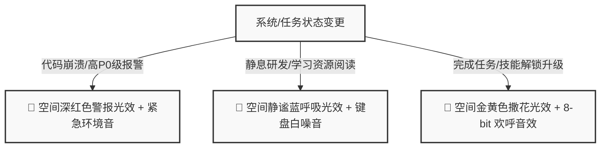

# 🗺️ OfficeCraft AI - 2D 像素数字孪生办公室 PRD (产品需求文档)

## 一、 产品定位与愿景

### 1.1 背景 (Background)
传统的职业在线培训产品（如在线题库、视频课程）往往是单向、被动且孤立的。学习者在枯燥的交互中完成练习，无法体验真实职场中复杂的**人际沟通、空间协作、多方利益博弈**以及**即时业务压力**。

### 1.2 产品定义 (Product Definition)
**OfficeCraft AI** 是一款**面向技术学习者的 2D 像素风虚拟职场数字孪生沙盒**。它将传统的“职业任务面板”重构为一张**可走动、可探索、有空间记忆的 2D 像素虚拟办公室**（类似 Gather.town / 星露谷物语风格）。
用户将扮演一名初入职场的研发人员或数据分析师，通过键盘 `W-A-S-D` 物理控制像素角色在数字孪生空间中穿梭，与多位具有独立人格的 AI 同事/主管进行空间交互、共同参与动态会议、协调团队冲突、在真实的沙盒中完成任务并逐步点亮技能树。

```text
+-------------------------------------------------------------+
|                     OfficeCraft AI 空间视图                 |
|                                                             |
|   [研发区]                [会议室]            [资料库/RAG]   |
|   +-----------+          +-----------+        +-----------+ |
|   | 🧑‍💻 (用户)  |  -WASD-> | 🧑‍💼 PM Amy |        | 📚 概念书架| |
|   |           |          | 👨‍💼 主管高凌|        | 📖 最佳实践| |
|   +-----------+          +-----------+        +-----------+ |
|        |                                                    |
|        +--- 触发任务/协作 ---> 发生“Prompt-to-Light”环境光效 |
+-------------------------------------------------------------+
```

### 1.3 核心愿景 (Vision)
* **让学习像探索游戏一样沉浸**：打破枯燥的表单网页，用 2D 像素美学、空间探索和复古电子音效包裹硬核技能练习。
* **从“单机做题”升级为“团队协同”**：AI 不仅是出题人，更是会争吵、有记忆、有偏好的活生生的同事（数字孪生团队）。
* **空间感知反馈**：利用环境灯光（Prompt-to-Light）和空间音效，将无形的任务压力与成功反馈外化为空间感官体验。

---

## 二、 目标用户与使用场景

### 2.1 目标用户 (Target Audience)
* **高校在校生/应届生**：计算机、软件工程、数据科学等相关专业，缺乏真实企业实习经验，渴望了解真实职场研发流程。
* **职业转行者**：希望在安全、低成本、有温度的环境下体验真实岗位交付物标准，缓解求职焦虑。
* **极客/复古游戏爱好者**：偏爱 2D 像素风格、喜欢沉浸式剧情和沙盒玩法的开发者。

### 2.2 典型使用场景 (Use Cases)
* **情境一：晨会与任务接取 (Morning Standup)**
  用户早上登入系统，控制像素小人走到[会议室]。AI 团队自动拉起“每日站会”，技术主管高凌指派今日任务（“解决 UserService 的 N+1 查询问题”）。
* **情境二：卡壳与空间检索 (Spatial RAG Search)**
  用户在写代码时卡壳，控制角色穿过走廊，来到[资料库/书架区]。用户点击对应的 Python 概念书架，弹出 RAG 搜索框，语义匹配出最相关的本地教程。
* **情境三：职场冲突调解 (Conflict Resolution)**
  产品经理 Amy 在群里催促上线一个可能导致系统崩溃的抢购功能，而高凌强烈反对。系统警报红光闪烁，用户必须控制角色走到两人中间，通过对话协调双方冲突，给出一个“多人偏好折中方案”。

---

## 三、 空间地图设计 (Spatial Layout)

虚拟办公室采用 **25×25 像素网格** 地图，由以下四个核心区域构成：

| 区域名称 | 物理坐标区间 | 包含的交互 NPC/物件 | 空间功能描述 |
| :--- | :--- | :--- | :--- |
| **Lobby (前台大厅)** | `(0,0)` 到 `(8,10)` | 门禁、像素绿植、签到打卡机 | 玩家登录落脚点，查看累计总 XP 及成就奖牌墙。 |
| **Dev Bay (研发区)** | `(0,11)` 到 `(12,24)`| 玩家工位、AI 同事工位、像素电脑 | 个人工作站，用户在此进行代码/报告编写，查看本地 Task 看板。 |
| **Meeting Room (会议室)** | `(13,0)` 到 `(24,12)`| 会议圆桌、白板、主管高凌/PM Amy | 发起“每日晨会”和“多人冲突协调”的剧情触发场所。 |
| **Archive Room (资料库)** | `(13,13)` 到 `(24,24)`| RAG 实体书架、咖啡机 | 物理化知识库检索地。点击不同书架，语义召回 Pandas / 架构设计文档。 |

---

## 四、 核心功能模块规格

### 4.1 2D 像素空间探索与 RPG 交互 (RPG Navigation)
* **操作方式**：支持键盘 `W-A-S-D` / 键盘方向键，或点击鼠标路标寻路。
* **碰撞检测 (Collision)**：墙壁、圆桌、书架、NPC 具有碰撞实体，不可穿透。
* **交互触发**：当玩家角色靠近 NPC 或交互物件 1 格范围内时，其头顶弹出像素按键提示（如 `[Space] Talk` 或 `[Space] Search`）。按下空格键打开沉浸式复古 RPG 对话框或功能面板。

### 4.2 空间 NPC 交互与长效情感导师 (Interactive NPCs & Memory)
* **独立人格设定**：
  * **高凌 (Tech Lead)**：严谨、严厉，重视代码质量，反对无底线堆砌功能，口头禅是“先跑一下单测”。
  * **郑莹 (Senior Data Analyst)**：专业、循循善诱，善于挖掘数据背后的商业洞察，对新手极其温柔。
  * **Amy (Product Manager)**：业务导向、风风火火，总是追求最快上线。
* **记忆继承 (Memory Inheritance)**：
  * **机制**：当玩家与导师（高凌/郑莹）对话时，AI 导师能检索用户的历史评估数据。
  * **示例**：如果用户上一关在“N+1 查询”上被退回过一次，高凌在指派下一关“数据库迁移”时会主动嘱咐：“上个任务的性能问题你改得不错，这次迁移可千万别再犯类似的低级错误了。”

### 4.3 主动式 Agent 会议与多人偏好冲突协调 (Multi-Agent Team Meeting)
* **每日晨会 (Daily Standup)**：用户接取关卡（如 Task 1 $\rightarrow$ Task 2）时，必须控制角色进入会议室。AI 主管与 AI 团队会自动开启一轮流式站会对话，指派任务背景并配发“物理数据物料（CSV/代码）”。
* **冲突博弈关卡 (Conflict Resolution)**：
  * **触发**：特定剧情阶段触发（如数据指标下滑或架构演进冲突）。
  * **玩法**：整个办公室陷入红光预警，Amy 和高凌在会议桌前争吵。用户必须走到他们中间，开启“冲突斡旋面板”。用户需输入协调方案，大模型基于多角色偏好进行综合评分，成功调解则各方技能树大幅加分。

### 4.4 空间环境光效感知体系 ("Prompt-to-Light")
系统将数字世界中的“状态、压力、成就”外化为**空间视觉光影和环境音效**：



* **实现形式**：前端通过 CSS Backdrop-Filter、CSS 阴影（`box-shadow`）以及全局 SVG 遮罩层实现平滑的动态环境光晕滤镜转换。

### 4.5 场景物理化 RAG 资料检索 (Spatial RAG Bookcase)
* **交互方式**：用户移动到 [资料库] 的不同“实体书架”（如：Pandas 书架、软件设计原则书架）。
* **功能**：点击书架弹出复古羊皮纸检索框，用户输入自然语言，后台 ChromaDB 仅在当前书架对应的物理 Markdown 文件中进行 Top-K 段落召回，彻底打通物理空间与检索上下文。

---

## 五、 非功能性需求与体验指标

### 5.1 极致视觉表现力 (Esthetics)
* **色板约束**：采用经典的 **16 色/32 色复古调色盘**，严禁出现刺眼的纯红纯蓝，全站采用现代 HSL 渐变与像素锯齿风格相结合。
* **微动效 (Micro-Animations)**：
  * 像素小人有四方向行走动画（Idle、Walk 动效）。
  * 按钮悬浮时具有 1px 位移沉降，点击时有像素粒子爆开动效（CSS Particle）。
  * 对话框文字流输出时，伴随复古 FC 游戏 8-bit 的滴答音效。

### 5.2 响应与无损恢复 (Performance & UX)
* **零配置/零门槛**：提供全量内置本地 Fallback 离线剧本，在无 LLM API Key 的情况下也能流畅体验全部 2D RPG 空间和基本关卡流程。
* **刷新无损恢复 (State Preservation)**：用户在任何位置（例如：在会议室中、正在与高凌争吵时）刷新网页，Pinia/Zustand 与 SQLite 联动，能 100% 恢复用户的**空间坐标、当前环境光效、未读的站会对话流**，保证沉浸感不被打断。
