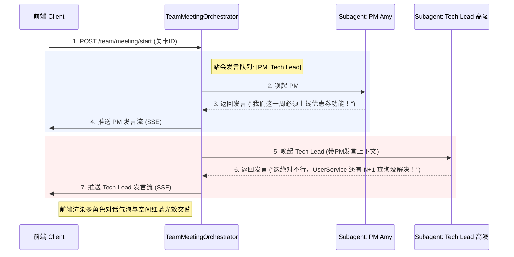

# 🛠️ OfficeCraft AI - 2D 像素数字孪生办公室技术实现文档

## 一、 系统架构升级

OfficeCraft AI 保持原有的前后端分离拓扑，但引入了**空间状态同步机制**、**环境光效控制管道**与**记忆检索增强链**。

```text
+-----------------------+              +------------------------+
|   Next.js (React)     |   API/SSE    |    FastAPI (Python)    |
|                       | <==========> |                        |
|  +-----------------+  |              |  +------------------+  |
|  | useSpaceStore   |  |              |  |TeamOrchestrator  |  |
|  | (位置/光效/状态) |  |              |  +------------------+  |
|  +-----------------+  |              |            |           |
|  +-----------------+  |              |  +------------------+  |
|  | CSS Grid 渲染器  |  |              |  |MemoryRetrieveChain|  |
|  +-----------------+  |              |  +------------------+  |
+-----------------------+              +------------------------+
                                                    |
                                       +------------+------------+
                                       |                         |
                             +-------------------+    +---------------------+
                             | SQLite (关系存储)  |    | ChromaDB (向量存储) |
                             | - 空间物理坐标     |    | - RAG 概念切片      |
                             | - 情感与反馈记忆   |    | - 导师对话记忆      |
                             +-------------------+    +---------------------+
```

---

## 二、 前端：2D 像素空间渲染与碰撞引擎

为了保持轻量、高性能且易于在 React (Next.js) 中快速实现，我们摒弃重型 Canvas/Phaser 引擎，采用 **DOM 绝对定位 (translate3d) + Tailwind CSS 硬件加速** 的网格渲染方案。

### 2.1 网格数学模型 (Grid Mathematics)
* **格子像素尺寸 ($S$)**：`32px`。
* **地图网格大小**：$25 \times 25$。
* **渲染公式**：任意实体（玩家、NPC、书架）的物理像素坐标 $(X_{px}, Y_{px})$ 计算如下：
  $$X_{px} = x \times S$$
  $$Y_{px} = y \times S$$
* **DOM 渲染元素样式**：
  ```tsx
  style={{
    transform: `translate3d(${x * 32}px, ${y * 32}px, 0)`,
    width: '32px',
    height: '32px',
    transition: 'transform 0.1s linear' // 顺滑平移走位
  }}
  ```

### 2.2 碰撞检测 (Collision Matrix)
地图初始化时生成一个二维二进制矩阵 $M_{25\times25}$：
* $M[y][x] = 1$：代表不可穿透实体（墙壁、桌子、NPC、书架占位）。
* $M[y][x] = 0$：代表可通行空地。

**玩家移动碰撞拦截算法 (React 伪代码)**：
```typescript
const movePlayer = (dx: number, dy: number) => {
  const nextX = player.x + dx;
  const nextY = player.y + dy;
  
  // 越界与碰撞矩阵拦截
  if (nextX >= 0 && nextX < 25 && nextY >= 0 && nextY < 25) {
    if (collisionMatrix[nextY][nextX] === 0) {
      updatePlayerPosition(nextX, nextY); // 更新 Zustand 状态，触发渲染
    }
  }
};
```

---

## 三、 空间状态机与环境光效管道 (Prompt-to-Light)

### 3.1 空间状态管理 (`useSpaceStore`)
前端在 Zustand 中定义全局空间状态，包含玩家实时坐标、周边可互动实体、以及当前的空间环境光主题：

```typescript
type AmbientTheme = 'quiet-blue' | 'alert-red' | 'celebrate-gold' | 'default';

interface SpaceState {
  playerCoord: { x: number; y: number };
  ambientTheme: AmbientTheme;
  interactiveNpId: string | null; // 距离用户 1 格内的 NPC
  setPlayerCoord: (x: number, y: number) => void;
  setAmbientTheme: (theme: AmbientTheme) => void;
}
```

### 3.2 Prompt-to-Light CSS 管道实现
全局样式中定义高斯模糊的遮罩层和发光阴影变量：

```css
/* global.css */
:root {
  --ambient-color: rgba(255, 255, 255, 0);
  --ambient-glow: 0px 0px 0px rgba(255, 255, 255, 0);
}

.ambient-theme-alert-red {
  --ambient-color: rgba(239, 68, 68, 0.15);
  --ambient-glow: inset 0 0 80px rgba(239, 68, 68, 0.4), 0 0 20px rgba(239, 68, 68, 0.2);
}

.ambient-theme-quiet-blue {
  --ambient-color: rgba(59, 130, 246, 0.12);
  --ambient-glow: inset 0 0 80px rgba(59, 130, 246, 0.3);
}

.ambient-theme-celebrate-gold {
  --ambient-color: rgba(245, 158, 11, 0.15);
  --ambient-glow: inset 0 0 100px rgba(245, 158, 11, 0.5), 0 0 30px rgba(245, 158, 11, 0.3);
}

/* 全局环境光混合涂层，覆盖在 2D 地图上方 */
.ambient-overlay {
  pointer-events: none; /* 绝对不能拦截下方的点击和 WASD 事件 */
  background-color: var(--ambient-color);
  box-shadow: var(--ambient-glow);
  transition: background-color 0.5s ease, box-shadow 0.5s ease;
}
```

---

## 四、 后端：记忆检索增强链 (Memory Inheritance)

为了让 AI 导师拥有“懂玩家、有温度”的长效记忆，我们需要在 AI 推理调用（任务生成、评审反馈、自由聊天）前，前置检索 SQLite/ChromaDB。

### 4.1 情感与反馈记忆数据模型 (`UserEmotionalMemory`)
在 `backend/app/models/orm.py` 中新增 ORM 记录：

```python
class UserEmotionalMemory(Base):
    __tablename__ = "user_emotional_memories"
    
    id = Column(String, primary_key=True, default=lambda: str(uuid.uuid4()))
    user_id = Column(String, index=True, nullable=False)
    created_at = Column(DateTime, default=datetime.utcnow)
    
    # 记忆元数据
    skill_id = Column(String, nullable=True) # 针对哪项技术（如 Pandas, Git）
    sentiment_tag = Column(String, nullable=False) # positive (高光) / negative (卡壳、退回) / neutral
    summary_text = Column(Text, nullable=False) # 结构化简短记忆（如 "对 SQL N+1 优化理解较慢，曾被退回"）
```

### 4.2 记忆注入 Prompt 渲染引擎
在 `backend/app/services/agents/base.py` 中，拼装最终 LLM Payload 时引入 `inject_memories`：

```python
def build_memory_aware_prompt(user_id: str, mentor_id: str, raw_system_prompt: str) -> str:
    # 1. 从 SQLite 中读取该用户最近 3 条与该职业相关的卡壳或高光记忆
    db = next(get_db())
    memories = db.query(UserEmotionalMemory).filter(
        UserEmotionalMemory.user_id == user_id
    ).order_by(UserEmotionalMemory.created_at.desc()).limit(3).all()
    
    # 2. 格式化为 Markdown 记忆清单
    memory_bullets = []
    for m in memories:
        tag_desc = "用户高光表现" if m.sentiment_tag == "positive" else "用户卡壳/需要重点指导点"
        memory_bullets.append(f"- [{tag_desc}] {m.summary_text} (记录时间: {m.created_at.strftime('%Y-%m-%d')})")
        
    memory_context = "\n".join(memory_bullets) if memory_bullets else "暂无该用户历史协作记忆，请作为新员工友好对待。"
    
    # 3. 将记忆上下文动态包裹并灌入 System Prompt 中
    memory_wrapped_prompt = f"""
{raw_system_prompt}

# 🧠 你的专属空间记忆 (你对当前用户的印象)
[IMPORTANT] 以下是你与该玩家共同在 OfficeCraft 虚拟办公室协作沉淀下来的真实记忆。
在你的开场白、任务派发或评审中，请**自然、不做作**地至少引用其中的一条记忆，向用户表达你的关注，拉近温情度：
<spatial_memories>
{memory_context}
</spatial_memories>
"""
    return memory_wrapped_prompt
```

---

## 五、 后端：多智能体会议编排引擎 (Team Standup)

每日站会采用**队列驱动的流式对话设计**。



### 5.1 站会发言队列持久化结构 (`TeamMeetingRecord`)
```python
class TeamMeetingLog(Base):
    __tablename__ = "team_meeting_logs"
    
    id = Column(String, primary_key=True, default=lambda: str(uuid.uuid4()))
    user_id = Column(String, index=True)
    mission_id = Column(String)
    
    # 完整的站会流 JSON 数据 (保存 PM 与 TL 唇枪舌战的历史上下文)
    dialogue_history_json = Column(Text, default="[]") 
    status = Column(String, default="active") # active / completed
```

---

## 六、 接口定义变更 (API Changes)

### 6.1 获取当前办公室与空间状态
* **路径**：`GET /api/v1/space/state`
* **请求头**：`X-Player-Id: <UUID>`
* **响应格式**：
  ```json
  {
    "player_coords": { "x": 12, "y": 15 },
    "ambient_theme": "quiet-blue",
    "map_assets_url": "http://localhost:8003/static/map_tile_v1.png",
    "unresolved_conflict": {
      "conflict_id": "conf_01",
      "trigger_npc_ids": ["pm_amy", "mentor_ling"],
      "description": "关于优惠券架构与发布速度的冲突正在会议室爆发，等待调解。"
    }
  }
  ```

### 6.2 同步用户空间坐标 (频率拦截：50ms 内节流)
* **路径**：`POST /api/v1/space/move`
* **请求体**：
  ```json
  {
    "x": 13,
    "y": 15
  }
  ```

### 6.3 物理书架 RAG 独立检索
* **路径**：`POST /api/v1/space/rag/search`
* **请求体**：
  ```json
  {
    "bookcase_id": "pandas_library", # 物理书架唯一标识
    "query": "如何合并两个有缺失值的 Dataframe"
  }
  ```
* **响应格式**：
  ```json
  {
    "bookcase_id": "pandas_library",
    "top_k_chunks": [
      {
        "doc_title": "docs/knowledge_base/data_analyst/pandas_join.md",
        "content_excerpt": "...使用 pd.merge(df1, df2, on='key', how='outer').fillna(0)...",
        "similarity_score": 0.89
      }
    ]
  }
  ```
